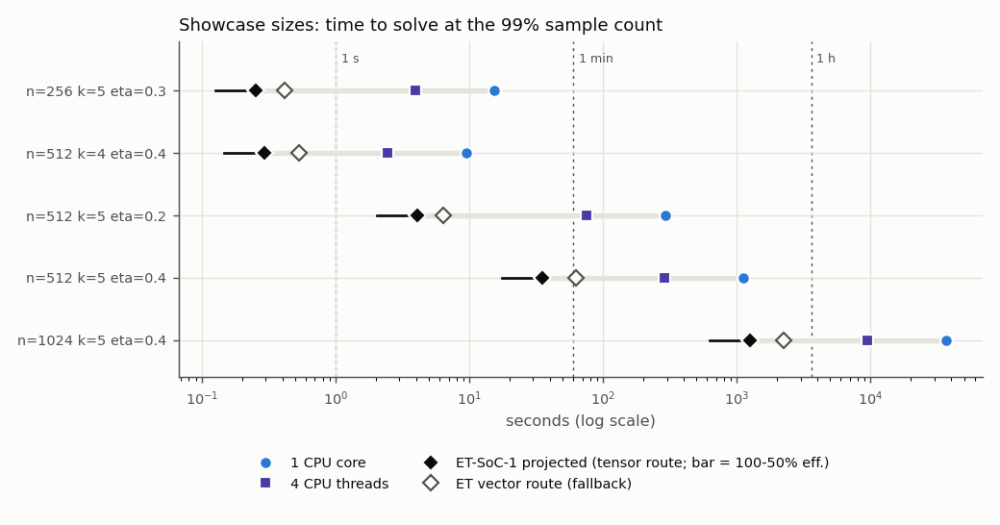
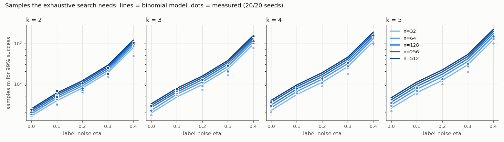
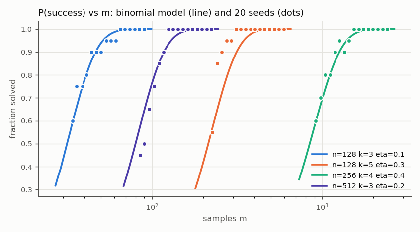
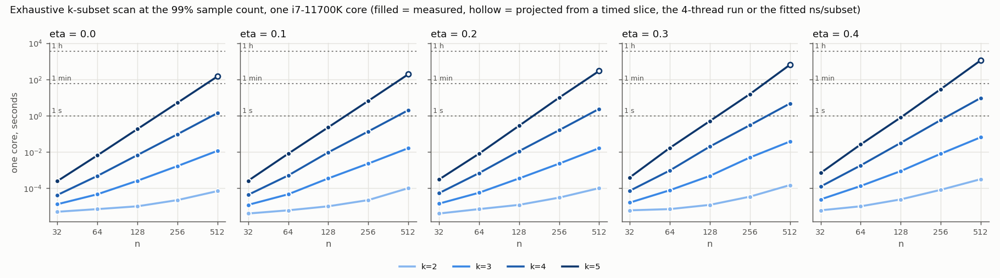
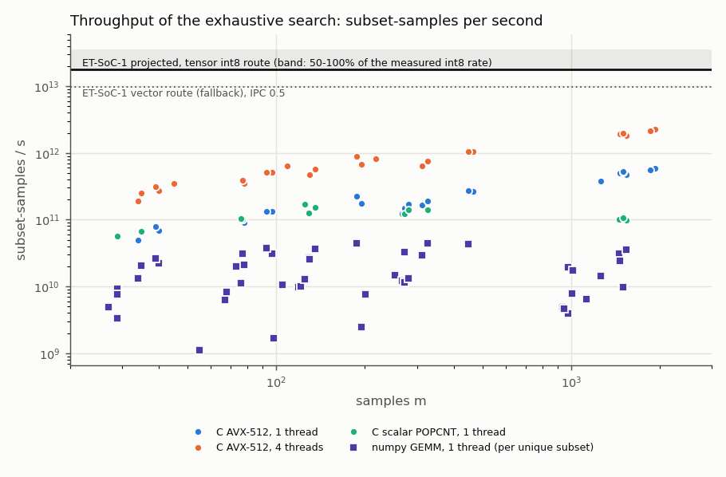

# Sparse parity on the CPU: toy prototypes, where the cost lands, and what the ET-SoC-1 would do (SP3)

28 September 2026. Host-CPU prototypes only: nothing here opened a card. The sweep ran niced on aifoundry1's host
(i7-11700K, Rocket Lake, AVX-512 VPOPCNTQ; 4 threads at most; `et-who --check` before every chunk, no card
holder appeared) and used about 42 CPU-minutes in 21 minutes of wall time. Raw data: `data/2026-09-28-aifoundry1/`.

**The problem.** x uniform in {0,1}^n, y = XOR of x over a secret k-subset, each label flipped with probability
eta. Recover the subset. Success = the exact secret (ties count as failures). "m99" = the smallest sample count at
which 20 of 20 seeds succeed.

## What we found

1. **Noiseless sparse parity is not a compute problem.** GF(2) elimination solves n = 512 in 1.3 ms, and every one of 400 runs
   (n = 32-512, all k) reached full rank by m = n + 6. The exhaustive search needs far fewer samples
   (log2 C(n,k) + about 6: 45 at n = 512, k = 5) but pays C(n,k) work, 2.4 min on one core at (512, 5).
2. **Label noise makes it a compute problem.** With eta > 0 elimination needs a clean sample subset. Even the best
   variant (random feature *and* sample subsets, `ncols` chosen to minimise the expected work) grows like
   (1-eta)^-ncols. It ties the exhaustive scan only at k = 5, eta = 0.1, n <= 128 (0.9-1.6x), and is 6-3,200x
   slower everywhere else. What remains is the exhaustive correlation search (= learning parity with noise by brute force):
   work C(n,k) x m, with m ~ 2 ln C(n,k) / (1-2 eta)^2. The binomial success model in `sp.py` predicts m99 to
   within 0.63-1.37x of the 20-seed measurement (median 0.86; 20/20 successes usually arrive below the 99% point),
   and `fig_model_check.png` shows its curves on top of the measured success rates.
3. **Best CPU implementation: a bit-packed XOR + popcount scan** (`spbits exh`): prefix XORs over
   i1 < ... < ik, AVX-512 VPOPCNTQ in the inner loop, columns zero-padded to 8 words. One core reaches
   5-6e11 subset-samples/s at m ~ 2,000 (0.3-1.3e11 at m <= 100, where the per-subset overhead dominates). 4 threads give
   3.89x (3.79-3.93x over 16 points). A scalar-POPCNT build is 2.9-4.9x slower at m ~ 1,000-1,500 and equal at m <= 256.
4. **The GEMM form is 3-72x slower on the CPU** (median 10x; numpy float32 on OpenBLAS at 3.4e10 MAC/s), but it is the form that
   fits the ET-SoC-1's int8 tensor unit. A **canonical split** fixes the redundancy. Each k-set is split one way
   only, A = its a = floor(k/2) smallest indices and B = the rest. Rows are sorted by max(A) and columns by min(B), so
   the valid (A, B) pairs form a block staircase. Every k-set is computed exactly once (1.01-1.19x the ideal MACs at
   n = 512 in numpy's blocks, 1.001x in 16x16 hardware tiles). The literal C(n,2) x C(n,2) form with collisions
   masked costs 3x that at k = 4 and 10x at k = 5 (`gemm_solve(split="all")`).
5. **Where the cost lands on one core** (`fig_cpu_cost.png`): everything with n <= 256, k <= 4 is under a second;
   (256, 5) takes 5-29 s; (512, 4) takes 1.4-9.4 s; (512, 5) takes 2.4-19 min; (1024, 5, eta 0.4) takes 10 hours.
   The MLP (online SGD, the Barak et al. style) solves n <= 128, k = 3 and n <= 64, k = 4 in 0.2-3 s, but from
   3e4-2.5e5 samples, against 20-35 for the noiseless correlation search (up to ~150 at eta = 0.2), and with
   1e9-6e10 MACs.
6. **Projected on the ET-SoC-1** (tensor int8 route at 50% of the measured int8 rate, 1.8e13 subset-samples/s):
   29-71x one Rocket Lake core and 7.6-18x four threads at the showcase sizes. That is 4-9x the whole 8-core host,
   assuming it scales like the 4-thread runs. The chip wins most where m is small, since the CPU's per-subset
   overhead then dominates, and least at eta = 0.4, where AVX-512 popcount is at its best. These are projections,
   not measurements: the kernel does not exist yet.

## Showcase sizes

All four are one launch of an embarrassingly parallel scan. They have 130,816 (n = 512) or 523,776 (n = 1,024)
independent prefix tasks, or 8,176 / 32,736 canonical row tiles, for 1,024 minions. The data fits in every shire's
L2 scratchpad: 138 KB bit-packed and 1.1 MB as int8 at n = 512, m = 2,151. The result is one (count, index) per
hart.

| | n | k | eta | m | work (subset-samples) | 1 CPU core | 4 CPU threads | ET-SoC-1 projected (tensor route, 100%-50% eff.) | vs 1 core | vs 4 threads |
|---|---|---|---|---|---|---|---|---|---|---|
| S1: seconds | 512 | 4 | 0.4 | 1,850 | 5.2e12 | 9.4 s (measured) | 2.4 s (measured) | 0.15-0.29 s | 32x | 8.3x |
| S2: minutes | 512 | 5 | 0.2 | 218 | 6.3e13 | 4.8 min (timed 1/32 slice) | 76 s (measured) | 2.1-4.1 s | 71x | 18x |
| S3: a quarter hour | 512 | 5 | 0.4 | 2,151 | 6.2e14 | 18.8 min (timed 1/32 slice) | 4.8 min (1T / 3.89) | 17-35 s | 32x | 8.3x |
| S4: hours | 1,024 | 5 | 0.4 | 2,373 | 2.2e16 | 10.3 h (timed 1/2048 slice) | 2.6 h (1T / 3.89) | 10.5-21 min | 29x | 7.6x |

A fully measured extra point: (256, 5, 0.3) with m = 466 takes 15.4 s on one core and 3.9 s on four threads,
against 0.13-0.25 s projected. The vector route, the fallback with no tensor unit, is 1.6-1.8x slower than the tensor
route's central value (`fig_showcase.png`). At the ~60 W board power measured under int8 load, S3 would cost about
2 kJ and S4 about 76 kJ on the card. The CPU's energy was not measured.

S1 is a correctness demo that should finish in under a second on the card. S2 is the size where the chip is most
clearly better than the host (the CPU pays per-subset overhead at small m). S3 and S4 are the high-noise sizes where
a single core needs a coffee break or an overnight run.



## ET-SoC-1 throughput assumptions

These come from this repo's measurements and are parameters in `report.py` (the `ET` dict), so SP2's numbers can
be substituted and every projection regenerated.

| Quantity | Value | Source |
|---|---|---|
| Minions | 1,024 (32 compute shires x 32; the kernel-visible part of the 1,088) | `docs/et-soc1-notes.md` |
| Clock | 600 MHz, the sustained clock on a warm die (800 MHz only below ~65 C) | notes, DVFS findings |
| int8 tensor rate | TensorIMA8A32, 71.8 TOP/s = 35.9e12 MAC/s measured (91% of 128 op/minion-cycle, `kernels/mmbench`, 18 Sep) | notes, "Tensor unit" |
| Central efficiency | 50% of that rate. With private streaming, int8 drew 4 B/cycle and took 512 cycles/op; 100% needs mmbench-style shared B tiles | notes, "ridge points" |
| Tensor work | canonical-split MACs in 16x16 output tiles, K = 64 samples per op (m rounded up to 64): C(n,k) x m x ~1.001 | `sp.gemm_macs(tile=16, round_cols=True)` |
| Vector route | 256-bit packed-int VPU with no popcount instruction (MASKPOPC counts only an 8-bit mask): XOR + carry-save adders, ~8 instructions per 256 subset-samples, IPC 0.25-1 (0.5 central) | PRM; estimate |
| Board power | ~60 W under full int8 load (57-62 W with mmbench) | notes |
| Not modelled | kernel launch and the upload of 0.1-1 MB. They matter only below ~10 ms, so the sub-ms cells of the projection table are not meaningful | |

**How the search maps onto the chip (tensor route, a sketch for SP4).**
- Encode each feature as bytes 0x01 / 0xFF (+1 / -1). A product of +-1 bytes is an XOR: a*b = a ^ b ^ 0x01 per byte,
  one `fxor.pi` per 32 bytes per extra factor.
- Rows are a-subset products times y (a = floor(k/2)); columns are b-subset products. Rows are sorted by their
  largest index and columns by their smallest, and a row tile only visits the columns right of the staircase.
- Per shire, column tiles (16 b-subsets x m samples) are generated once into the L2 scratchpad and streamed by all
  32 minions (the neighbourhood coalesces identical loads). Each minion keeps its own row tiles, 8 per minion at
  n = 512, k = 4 or 5.
- Each 16x16 output tile takes ceil(m/64) TensorIMA8A32 ops accumulating in TenC. It is then copied to f0..f31 and
  reduced to a max with vector ops, with the staircase mask applied on boundary tiles. Operand generation is ~2% of
  the tensor time with this sharing.
- There is no inter-shire traffic and no DRAM traffic in the loop. The host reduces 2,048 (count, index) pairs.
- If TensorIMA8A32 is unsigned in an operand (the PRM text does not say), use 0/1 bytes instead:
  disagreements = |a| + |b| - 2<a,b>, with the row and column sums computed once per tile.
- The vector route (no tensor unit) is the same prefix-XOR scan as `spbits`, with carry-save popcounts. For k >= 4
  the subsets packed into one 256-bit word must share a prefix, so short last-index ranges leave words part-empty.
  That is why it is the fallback.

## Samples needed (m99)

Every cell reads "measured (model)". A `~` means model only: those (n, k) pairs were too big for a 20-seed search,
which costs about 6x a plain scan because it tracks every probe prefix. The model's m is what the timings use there.

| n | k | eta=0.0 | eta=0.1 | eta=0.2 | eta=0.3 | eta=0.4 |
|---|---|---|---|---|---|---|
| 32 | 2 | 16 (16) | 52 (38) | 59 (78) | 152 (187) | 481 (768) |
| 32 | 3 | 17 (19) | 53 (47) | 72 (95) | 162 (228) | 761 (939) |
| 32 | 4 | 20 (22) | 57 (54) | 88 (109) | 175 (262) | 936 (1082) |
| 32 | 5 | 21 (25) | 55 (60) | 98 (121) | 195 (292) | 976 (1204) |
| 64 | 2 | 18 (18) | 31 (44) | 63 (88) | 151 (212) | 859 (873) |
| 64 | 3 | 23 (22) | 58 (55) | 89 (110) | 201 (265) | 945 (1093) |
| 64 | 4 | 27 (26) | 59 (64) | 105 (130) | 252 (311) | 976 (1284) |
| 64 | 5 | 29 (30) | 67 (73) | 119 (147) | 268 (353) | 1258 (1455) |
| 128 | 2 | 18 (20) | 42 (49) | 70 (98) | 168 (236) | 959 (975) |
| 128 | 3 | 22 (26) | 65 (62) | 108 (125) | 201 (301) | 1006 (1241) |
| 128 | 4 | 29 (30) | 73 (74) | 129 (149) | 272 (358) | 1454 (1478) |
| 128 | 5 | 34 (35) | 78 (85) | 130 (171) | 312 (410) | 1465 (1694) |
| 256 | 2 | 20 (22) | 47 (54) | 77 (108) | 174 (261) | 929 (1075) |
| 256 | 3 | 27 (29) | 68 (69) | 121 (140) | 272 (336) | 1123 (1386) |
| 256 | 4 | 35 (35) | 77 (84) | 136 (168) | 327 (404) | 1537 (1666) |
| 256 | 5 | ~40 | ~97 | ~195 | ~466 | ~1925 |
| 512 | 2 | 23 (24) | 66 (59) | 102 (118) | 246 (284) | 1015 (1174) |
| 512 | 3 | 29 (32) | 76 (77) | 125 (154) | 281 (370) | 1502 (1527) |
| 512 | 4 | ~39 | ~93 | ~187 | ~448 | ~1850 |
| 512 | 5 | ~45 | ~109 | ~218 | ~521 | ~2151 |

measured / model over 85 points: median 0.86, range 0.63-1.37

 

## Where each solver's cost lands

| Regime | Best solver here | Cost at the largest grid sizes | Others |
|---|---|---|---|
| eta = 0 | GF(2) elimination (`spbits ge`) | n = 512: 1.3 ms, m <= n + 6 | exhaustive scan needs only log2 C(n,k) + ~6 samples but 2.4 min at (512, 5); MLP 0.2-3 s from 3e4-2.5e5 samples (n <= 128, k = 3) |
| eta = 0.1 | exhaustive scan | (512, 5): 3.2 min; (512, 4): 2.0 s | GE on random subsets ties only at k = 5, n <= 128 and is 6-120x slower elsewhere; numpy GEMM 3-72x slower |
| eta 0.2-0.4 | exhaustive scan | (512, 5): 4.8-18.8 min; (512, 4): 2.4-9.4 s | GE on random subsets 38-3,200x slower and unfinished within 20 s at (256, 3, 0.3); GEMM 3-72x slower |

Solver notes:
- **Exhaustive scan (C).** Single-thread cost per subset at n = 512 is 0.50 ns (1 word of 64 samples), 1.68 ns
  (8 words) and 3.33 ns (32 words): a fixed ~0.5 ns plus 0.09-0.15 ns per word. All 291 timing runs found the secret.
  The first timing pass without word padding was up to 1.7x slower where W was not a multiple of 8; those records are
  kept in `exh_unpadded.jsonl`.
- **GEMM (numpy).** All 91 runs found the secret. It is 3-72x slower than the bit scan (median 10x): float32 multiply-adds against
  64-bit popcounts, and forming the products and masks costs extra in numpy.
- **GF(2) elimination.** Rows are inserted one at a time, so one run per seed gives the exact m at which rank n is
  reached: n + 0 to n + 6 over 400 runs (all 400 solved), in 6 us (n = 32) to 1.3 ms (n = 512).
- **GE on random subsets (noisy).** A first pass verified candidates on a 256-sample pool and accepted wrong weight-k
  candidates at eta = 0.3 (kept as `gers_pool256.jsonl`). The final pass uses a pool of 2 x m99 and solves 217 of
  220 runs: two hit the 20 s cap at (256, 3, 0.3), and one still accepted a wrong weight-2 candidate at
  (256, 2, 0.3). The threshold test would need a union bound over the candidates it tries.
- **MLP (reference only).** One ReLU hidden layer of width 1,000, hinge loss, online SGD with batch 32 and lr 0.1,
  PyTorch-style init; success is >= 99% held-out accuracy against the clean parity. For k = 3 the steps needed
  grew roughly linearly in n over this range (1,000 at n = 20, 2,000 at 50, 3,500 at 64, 7,750 at 128); one seed
  at (64, 4) took 5,000. The hyperparameters are this
  script's, not the paper's.

 

## Files and how to reproduce

`workloads/sparseparity/proto/`:

| File | What it is |
|---|---|
| `spbits.c`, `Makefile` | C prototypes: `gen` (hash cross-check), `exh` (exhaustive scan, OpenMP, `slice=` for timing samples), `msearch` (one scan, success at every probe prefix), `ge` (noiseless elimination), `gers` (noisy elimination on random subsets). `spbits` = `-march=native`, `spbits_v3` = AVX2 + scalar POPCNT |
| `sp.py` | generator mirror (bit-identical instances; `--hash` matches `spbits gen`), `gemm_solve` (canonical or all-pairs split), numpy `ge_solve`, the success model `p_success` / `m99_model` |
| `mlp.py` | the MLP + SGD reference |
| `sweep.py`, `phase2.sh`, `slices.sh`, `mlp_more.sh` | the sweep drivers: niced, <= 4 threads, `et-who --check` before each chunk, CPU budget |
| `report.py` | tables (stdout), `fig_*.png`, and the ET projections (`ET` dict) |
| `data/2026-09-28-aifoundry1/` | raw JSONL, one object per run; `*_skipped.jsonl` lists the points that were projected instead of run |

```bash
cd workloads/sparseparity/proto && make
./spbits gen n=64 k=3 eta=0.1 m=100 seed=1                        # same hash as the next line
python3 sp.py --n 64 --k 3 --eta 0.1 --m 100 --seed 1 --hash --solvers none
./spbits exh n=256 k=5 eta=0.3 m=466 seed=1 threads=4             # the extra point: ~4 s on 4 threads
./spbits exh n=512 k=5 eta=0.4 m=2151 seed=1 threads=1 slice=32   # S3 timing slice, ~35 s
OPENBLAS_NUM_THREADS=1 python3 sp.py --n 128 --k 4 --eta 0.2      # numpy GEMM at the model's m
./spbits ge n=512 k=5 seed=1 mmax=600
./spbits gers n=128 k=3 eta=0.1 m=256 seed=1 ncols=14 extra=8
OPENBLAS_NUM_THREADS=1 python3 mlp.py --n 50 --k 3 --seeds 1,2,3
# the sweep as run (sweep 'all' was stopped at its gemm step; phase2 re-ran that with the canonical GEMM):
OPENBLAS_NUM_THREADS=1 nice -n 19 python3 sweep.py all --out results --threads 4 --budget-s 4000 --exh-threaded-cap-cpu-s 400
nice -n 19 ./phase2.sh results && nice -n 19 ./slices.sh results && nice -n 19 ./mlp_more.sh results
python3 report.py --data data/2026-09-28-aifoundry1 --png-dir .   # prints the appendix tables, writes fig_*.png
```

## Caveats

- The ET-SoC-1 times are projections from measured tensor and vector rates, not runs. The card kernel is the next
  step, and launch and upload costs are not modelled.
- CPU times are for one desktop Rocket Lake core at turbo clocks (~4.6 GHz), niced on an otherwise idle host. A
  server core or all 8 cores would narrow the gap: 8 cores at the measured 3.89x-per-4 scaling would be ~2x the
  4-thread column.
- Model-only m (the `~` cells) was used for (256, 5), (512, 4) and (512, 5), and off-grid for n = 1,024. On the 85
  measured points the model sat at 0.63-1.37x of the 20-seed value.
- Not tried: sub-cubic correlation finding (Valiant's fast-matrix-multiplication approach), BKW-style reduction,
  int8 VNNI GEMM on the CPU, and curriculum or other tricks for the MLP.

## Appendix: full tables

Output of `python3 report.py --data data/2026-09-28-aifoundry1`. The ET columns use the `ET` dict.

### Samples needed: smallest m with 20/20 seeds solved (exhaustive / GEMM estimator)

Measured by one scan per seed over nested prefixes (`spbits msearch`); `model` is the smallest m with P(success) >= 0.99 under the independent-binomial model; a `~` entry had no measured search (model only).

| n | k | eta=0.0 | eta=0.1 | eta=0.2 | eta=0.3 | eta=0.4 |
|---|---|---|---|---|---|---|
| 32 | 2 | 16 (16) | 52 (38) | 59 (78) | 152 (187) | 481 (768) |
| 32 | 3 | 17 (19) | 53 (47) | 72 (95) | 162 (228) | 761 (939) |
| 32 | 4 | 20 (22) | 57 (54) | 88 (109) | 175 (262) | 936 (1082) |
| 32 | 5 | 21 (25) | 55 (60) | 98 (121) | 195 (292) | 976 (1204) |
| 64 | 2 | 18 (18) | 31 (44) | 63 (88) | 151 (212) | 859 (873) |
| 64 | 3 | 23 (22) | 58 (55) | 89 (110) | 201 (265) | 945 (1093) |
| 64 | 4 | 27 (26) | 59 (64) | 105 (130) | 252 (311) | 976 (1284) |
| 64 | 5 | 29 (30) | 67 (73) | 119 (147) | 268 (353) | 1258 (1455) |
| 128 | 2 | 18 (20) | 42 (49) | 70 (98) | 168 (236) | 959 (975) |
| 128 | 3 | 22 (26) | 65 (62) | 108 (125) | 201 (301) | 1006 (1241) |
| 128 | 4 | 29 (30) | 73 (74) | 129 (149) | 272 (358) | 1454 (1478) |
| 128 | 5 | 34 (35) | 78 (85) | 130 (171) | 312 (410) | 1465 (1694) |
| 256 | 2 | 20 (22) | 47 (54) | 77 (108) | 174 (261) | 929 (1075) |
| 256 | 3 | 27 (29) | 68 (69) | 121 (140) | 272 (336) | 1123 (1386) |
| 256 | 4 | 35 (35) | 77 (84) | 136 (168) | 327 (404) | 1537 (1666) |
| 256 | 5 | ~40 | ~97 | ~195 | ~466 | ~1925 |
| 512 | 2 | 23 (24) | 66 (59) | 102 (118) | 246 (284) | 1015 (1174) |
| 512 | 3 | 29 (32) | 76 (77) | 125 (154) | 281 (370) | 1502 (1527) |
| 512 | 4 | ~39 | ~93 | ~187 | ~448 | ~1850 |
| 512 | 5 | ~45 | ~109 | ~218 | ~521 | ~2151 |

measured / model over 85 points: median 0.86, range 0.63-1.37

### Exhaustive scan (C, bit-packed XOR + popcount), wall time at that m

`1T` = one thread (median of up to 3 seeds), `4T` = four threads; `1T proj` = the one-core time from, in order of preference, a timed slice (`slice=S`: every S-th outer task), the 4T run x the measured 4-thread speedup, or C(n,k) x the per-n fitted ns/subset against padded W; for measured points it shows the fit, as a check. i7-11700K (aifoundry1), AVX-512 VPOPCNTQ build, columns zero-padded to 8 words above 4.

| n | k | eta | m | C(n,k) | 1T | 4T | 1T proj | subset-samples/s (1T) |
|---|---|---|---|---|---|---|---|---|
| 32 | 4 | 0.0 | 20 | 3.6e+04 | 42 us | - | 19 us (fit) | 1.71e+10 |
| 32 | 4 | 0.1 | 57 | 3.6e+04 | 43 us | - | 19 us (fit) | 4.77e+10 |
| 32 | 4 | 0.2 | 88 | 3.6e+04 | 53 us | - | 26 us (fit) | 5.97e+10 |
| 32 | 4 | 0.3 | 175 | 3.6e+04 | 72 us | - | 37 us (fit) | 8.74e+10 |
| 32 | 4 | 0.4 | 936 | 3.6e+04 | 123 us | - | 100 us (fit) | 2.74e+11 |
| 32 | 5 | 0.0 | 21 | 2.01e+05 | 245 us | - | 108 us (fit) | 1.73e+10 |
| 32 | 5 | 0.1 | 55 | 2.01e+05 | 257 us | - | 108 us (fit) | 4.31e+10 |
| 32 | 5 | 0.2 | 98 | 2.01e+05 | 301 us | - | 147 us (fit) | 6.56e+10 |
| 32 | 5 | 0.3 | 195 | 2.01e+05 | 392 us | - | 223 us (fit) | 1e+11 |
| 32 | 5 | 0.4 | 976 | 2.01e+05 | 693 us | - | 560 us (fit) | 2.84e+11 |
| 64 | 4 | 0.0 | 27 | 6.35e+05 | 473 us | - | 341 us (fit) | 3.63e+10 |
| 64 | 4 | 0.1 | 59 | 6.35e+05 | 501 us | - | 341 us (fit) | 7.48e+10 |
| 64 | 4 | 0.2 | 105 | 6.35e+05 | 676 us | - | 463 us (fit) | 9.87e+10 |
| 64 | 4 | 0.3 | 252 | 6.35e+05 | 946 us | - | 702 us (fit) | 1.69e+11 |
| 64 | 4 | 0.4 | 976 | 6.35e+05 | 1.8 ms | - | 1.8 ms (fit) | 3.46e+11 |
| 64 | 5 | 0.0 | 29 | 7.62e+06 | 6.4 ms | - | 4.1 ms (fit) | 3.45e+10 |
| 64 | 5 | 0.1 | 67 | 7.62e+06 | 8.0 ms | - | 5.6 ms (fit) | 6.4e+10 |
| 64 | 5 | 0.2 | 119 | 7.62e+06 | 8.0 ms | - | 5.6 ms (fit) | 1.14e+11 |
| 64 | 5 | 0.3 | 268 | 7.62e+06 | 16.7 ms | - | 16.7 ms (fit) | 1.23e+11 |
| 64 | 5 | 0.4 | 1258 | 7.62e+06 | 25.8 ms | - | 25.8 ms (fit) | 3.72e+11 |
| 128 | 2 | 0.0 | 18 | 8.13e+03 | 10 us | - | 6 us (fit) | 1.46e+10 |
| 128 | 2 | 0.1 | 42 | 8.13e+03 | 10 us | - | 6 us (fit) | 3.41e+10 |
| 128 | 2 | 0.2 | 70 | 8.13e+03 | 12 us | - | 7 us (fit) | 4.74e+10 |
| 128 | 2 | 0.3 | 168 | 8.13e+03 | 12 us | - | 8 us (fit) | 1.14e+11 |
| 128 | 2 | 0.4 | 959 | 8.13e+03 | 24 us | - | 20 us (fit) | 3.25e+11 |
| 128 | 3 | 0.0 | 22 | 3.41e+05 | 256 us | - | 234 us (fit) | 2.93e+10 |
| 128 | 3 | 0.1 | 65 | 3.41e+05 | 345 us | - | 293 us (fit) | 6.43e+10 |
| 128 | 3 | 0.2 | 108 | 3.41e+05 | 344 us | - | 293 us (fit) | 1.07e+11 |
| 128 | 3 | 0.3 | 201 | 3.41e+05 | 476 us | - | 414 us (fit) | 1.44e+11 |
| 128 | 3 | 0.4 | 1006 | 3.41e+05 | 874 us | - | 830 us (fit) | 3.93e+11 |
| 128 | 4 | 0.0 | 29 | 1.07e+07 | 6.7 ms | - | 7.3 ms (fit) | 4.63e+10 |
| 128 | 4 | 0.1 | 73 | 1.07e+07 | 9.4 ms | - | 9.1 ms (fit) | 8.27e+10 |
| 128 | 4 | 0.2 | 129 | 1.07e+07 | 11.0 ms | - | 11.1 ms (fit) | 1.25e+11 |
| 128 | 4 | 0.3 | 272 | 1.07e+07 | 19.8 ms | - | 20.3 ms (fit) | 1.47e+11 |
| 128 | 4 | 0.4 | 1454 | 1.07e+07 | 31.4 ms | - | 31.6 ms (fit) | 4.94e+11 |
| 128 | 5 | 0.0 | 34 | 2.65e+08 | 181.6 ms | 47.0 ms | 181.6 ms (fit) | 4.95e+10 |
| 128 | 5 | 0.1 | 78 | 2.65e+08 | 226.7 ms | 59.7 ms | 226.7 ms (fit) | 9.1e+10 |
| 128 | 5 | 0.2 | 130 | 2.65e+08 | 276.2 ms | 72.8 ms | 275.6 ms (fit) | 1.25e+11 |
| 128 | 5 | 0.3 | 312 | 2.65e+08 | 503.3 ms | 128.5 ms | 503.2 ms (fit) | 1.64e+11 |
| 128 | 5 | 0.4 | 1465 | 2.65e+08 | 789.2 ms | 202.9 ms | 783.3 ms (fit) | 4.91e+11 |
| 256 | 2 | 0.0 | 20 | 3.26e+04 | 22 us | - | 18 us (fit) | 2.97e+10 |
| 256 | 2 | 0.1 | 47 | 3.26e+04 | 22 us | - | 18 us (fit) | 6.97e+10 |
| 256 | 2 | 0.2 | 77 | 3.26e+04 | 30 us | - | 25 us (fit) | 8.38e+10 |
| 256 | 2 | 0.3 | 174 | 3.26e+04 | 34 us | - | 29 us (fit) | 1.67e+11 |
| 256 | 2 | 0.4 | 929 | 3.26e+04 | 81 us | - | 73 us (fit) | 3.74e+11 |
| 256 | 3 | 0.0 | 27 | 2.76e+06 | 1.6 ms | - | 1.5 ms (fit) | 4.52e+10 |
| 256 | 3 | 0.1 | 68 | 2.76e+06 | 2.3 ms | - | 2.1 ms (fit) | 8.29e+10 |
| 256 | 3 | 0.2 | 121 | 2.76e+06 | 2.2 ms | - | 2.1 ms (fit) | 1.49e+11 |
| 256 | 3 | 0.3 | 272 | 2.76e+06 | 4.9 ms | - | 4.7 ms (fit) | 1.53e+11 |
| 256 | 3 | 0.4 | 1123 | 2.76e+06 | 7.9 ms | - | 7.6 ms (fit) | 3.93e+11 |
| 256 | 4 | 0.0 | 35 | 1.75e+08 | 93.9 ms | 24.4 ms | 94.4 ms (fit) | 6.52e+10 |
| 256 | 4 | 0.1 | 77 | 1.75e+08 | 134.5 ms | 34.6 ms | 134.4 ms (fit) | 1e+11 |
| 256 | 4 | 0.2 | 136 | 1.75e+08 | 157.2 ms | 41.0 ms | 157.2 ms (fit) | 1.51e+11 |
| 256 | 4 | 0.3 | 327 | 1.75e+08 | 298.4 ms | 76.7 ms | 298.5 ms (fit) | 1.92e+11 |
| 256 | 4 | 0.4 | 1537 | 1.75e+08 | 570.8 ms | 146.4 ms | 572.5 ms (fit) | 4.71e+11 |
| 256 | 5 | 0.0 | 40 | 8.81e+09 | 5.1 s | 1.3 s | 4.8 s (fit) | 6.91e+10 |
| 256 | 5 | 0.1 | 97 | 8.81e+09 | 6.5 s | 1.7 s | 6.8 s (fit) | 1.32e+11 |
| 256 | 5 | 0.2 | 195 | 8.81e+09 | 9.7 s | 2.6 s | 9.7 s (fit) | 1.76e+11 |
| 256 | 5 | 0.3 | 466 | 8.81e+09 | 15.4 s | 3.9 s | 15.0 s (fit) | 2.66e+11 |
| 256 | 5 | 0.4 | 1925 | 8.81e+09 | 28.9 s | 7.4 s | 28.9 s (fit) | 5.86e+11 |
| 512 | 2 | 0.0 | 23 | 1.31e+05 | 69 us | - | 65 us (fit) | 4.36e+10 |
| 512 | 2 | 0.1 | 66 | 1.31e+05 | 100 us | - | 94 us (fit) | 8.63e+10 |
| 512 | 2 | 0.2 | 102 | 1.31e+05 | 100 us | - | 94 us (fit) | 1.33e+11 |
| 512 | 2 | 0.3 | 246 | 1.31e+05 | 148 us | - | 131 us (fit) | 2.17e+11 |
| 512 | 2 | 0.4 | 1015 | 1.31e+05 | 314 us | - | 298 us (fit) | 4.23e+11 |
| 512 | 3 | 0.0 | 29 | 2.22e+07 | 11.5 ms | - | 11.1 ms (fit) | 5.62e+10 |
| 512 | 3 | 0.1 | 76 | 2.22e+07 | 16.0 ms | - | 16.0 ms (fit) | 1.05e+11 |
| 512 | 3 | 0.2 | 125 | 2.22e+07 | 16.0 ms | - | 16.0 ms (fit) | 1.73e+11 |
| 512 | 3 | 0.3 | 281 | 2.22e+07 | 37.4 ms | - | 37.3 ms (fit) | 1.67e+11 |
| 512 | 3 | 0.4 | 1502 | 2.22e+07 | 64.1 ms | 17.1 ms | 64.1 ms (fit) | 5.21e+11 |
| 512 | 4 | 0.0 | 39 | 2.83e+09 | 1.4 s | 355.3 ms | 1.4 s (fit) | 7.98e+10 |
| 512 | 4 | 0.1 | 93 | 2.83e+09 | 2.0 s | 516.2 ms | 2.0 s (fit) | 1.32e+11 |
| 512 | 4 | 0.2 | 187 | 2.83e+09 | 2.4 s | 603.9 ms | 2.4 s (fit) | 2.25e+11 |
| 512 | 4 | 0.3 | 448 | 2.83e+09 | 4.7 s | 1.2 s | 4.7 s (fit) | 2.72e+11 |
| 512 | 4 | 0.4 | 1850 | 2.83e+09 | 9.4 s | 2.4 s | 9.4 s (fit) | 5.55e+11 |
| 512 | 5 | 0.0 | 45 | 2.88e+11 | - | 37.4 s | 2.4 min (4T x 3.89) | - |
| 512 | 5 | 0.1 | 109 | 2.88e+11 | - | 49.1 s | 3.2 min (4T x 3.89) | - |
| 512 | 5 | 0.2 | 218 | 2.88e+11 | - | 75.7 s | 4.8 min (slice 1/32) | - |
| 512 | 5 | 0.3 | 521 | 2.88e+11 | - | - | 10.7 min (slice 1/32) | - |
| 512 | 5 | 0.4 | 2151 | 2.88e+11 | - | - | 18.8 min (slice 1/32) | - |

(n <= 64 with k <= 3 omitted: all under 1 ms.) Solved: 291/291 timing runs.

4-thread speedup where 1T > 0.2 s: median 3.89x (3.79-3.93x, 16 points)

Single-thread cost per subset (ns) by n and padded W, the basis of every projection:

- n=64: W=8: 2.18, W=24: 3.38
- n=128: W=1: 0.69, W=2: 0.86, W=3: 1.04, W=8: 1.90, W=24: 2.96
- n=256: W=1: 0.54, W=2: 0.77, W=3: 0.90, W=4: 1.11, W=8: 1.71, W=32: 3.28
- n=512: W=1: 0.50, W=2: 0.72, W=3: 0.83, W=8: 1.68, W=24: 2.88, W=32: 3.33

Scalar-POPCNT build (`spbits_v3`, x86-64-v3, no vector popcount) vs AVX-512 build, one thread:

| n | k | eta | m | v3 | AVX-512 | ratio |
|---|---|---|---|---|---|---|
| 128 | 3 | 0 | 22 | 245 us | 256 us | 1.0x |
| 128 | 3 | 0.1 | 65 | 335 us | 345 us | 1.0x |
| 128 | 3 | 0.2 | 108 | 348 us | 344 us | 1.0x |
| 128 | 3 | 0.3 | 201 | 454 us | 476 us | 1.0x |
| 128 | 3 | 0.4 | 1006 | 2.5 ms | 874 us | 2.9x |
| 128 | 4 | 0 | 29 | 6.5 ms | 6.7 ms | 1.0x |
| 128 | 4 | 0.1 | 73 | 9.3 ms | 9.4 ms | 1.0x |
| 128 | 4 | 0.2 | 129 | 11.0 ms | 11.0 ms | 1.0x |
| 128 | 4 | 0.3 | 272 | 23.6 ms | 19.8 ms | 1.2x |
| 128 | 4 | 0.4 | 1454 | 152.6 ms | 31.4 ms | 4.9x |
| 256 | 4 | 0 | 35 | 91.8 ms | 93.9 ms | 1.0x |
| 256 | 4 | 0.1 | 77 | 132.9 ms | 134.5 ms | 1.0x |
| 256 | 4 | 0.2 | 136 | 156.5 ms | 157.2 ms | 1.0x |
| 256 | 4 | 0.3 | 327 | 407.8 ms | 298.4 ms | 1.4x |
| 256 | 4 | 0.4 | 1537 | 2.7 s | 570.8 ms | 4.7x |
| 512 | 3 | 0 | 29 | 11.2 ms | 11.5 ms | 1.0x |
| 512 | 3 | 0.1 | 76 | 16.2 ms | 16.0 ms | 1.0x |
| 512 | 3 | 0.2 | 125 | 16.5 ms | 16.0 ms | 1.0x |
| 512 | 3 | 0.3 | 281 | 43.9 ms | 37.4 ms | 1.2x |
| 512 | 3 | 0.4 | 1502 | 316.2 ms | 64.1 ms | 4.9x |

### GEMM form (numpy float32 on OpenBLAS, one thread)

Effective rate on runs over 1e9 MACs: median 3.42e+10 MAC/s (includes forming the +-1 products and masking entries off the canonical staircase). Skipped points are projected at that rate.

| n | k | eta | m | MACs | redundancy vs C(n,k)m | numpy time | projected | C scan 1T |
|---|---|---|---|---|---|---|---|---|
| 32 | 2 | 0.0 | 16 | 1.59e+04 | 2.00 | 180 us | 0 us | 5 us |
| 32 | 2 | 0.2 | 59 | 5.85e+04 | 2.00 | 85 us | 2 us | 4 us |
| 32 | 2 | 0.4 | 481 | 4.77e+05 | 2.00 | 116 us | 14 us | 6 us |
| 32 | 3 | 0.0 | 17 | 2.53e+05 | 3.00 | 208 us | 7 us | 13 us |
| 32 | 3 | 0.2 | 72 | 1.07e+06 | 3.00 | 287 us | 31 us | 14 us |
| 32 | 3 | 0.4 | 761 | 1.13e+07 | 3.00 | 2.0 ms | 331 us | 24 us |
| 32 | 4 | 0.0 | 20 | 4.32e+06 | 6.00 | 916 us | 126 us | 42 us |
| 32 | 4 | 0.2 | 88 | 1.9e+07 | 6.00 | 1.2 ms | 555 us | 53 us |
| 32 | 4 | 0.4 | 936 | 2.02e+08 | 6.00 | 6.8 ms | 5.9 ms | 123 us |
| 32 | 5 | 0.0 | 21 | 4.23e+07 | 10.00 | 9.4 ms | 1.2 ms | 245 us |
| 32 | 5 | 0.2 | 98 | 1.97e+08 | 10.00 | 11.9 ms | 5.8 ms | 301 us |
| 32 | 5 | 0.4 | 976 | 1.97e+09 | 10.00 | 49.9 ms | 57.5 ms | 693 us |
| 64 | 2 | 0.0 | 18 | 7.26e+04 | 2.00 | 104 us | 2 us | 7 us |
| 64 | 2 | 0.2 | 63 | 2.54e+05 | 2.00 | 94 us | 7 us | 7 us |
| 64 | 2 | 0.4 | 859 | 3.46e+06 | 2.00 | 369 us | 101 us | 10 us |
| 64 | 3 | 0.0 | 23 | 2.87e+06 | 3.00 | 883 us | 84 us | 46 us |
| 64 | 3 | 0.2 | 89 | 1.11e+07 | 3.00 | 1.2 ms | 325 us | 56 us |
| 64 | 3 | 0.4 | 945 | 1.18e+08 | 3.00 | 8.4 ms | 3.5 ms | 132 us |
| 64 | 4 | 0.0 | 27 | 3.5e+07 | 2.04 | 4.3 ms | 1.0 ms | 473 us |
| 64 | 4 | 0.2 | 105 | 1.36e+08 | 2.04 | 6.2 ms | 4.0 ms | 676 us |
| 64 | 4 | 0.4 | 976 | 1.27e+09 | 2.04 | 31.7 ms | 37.0 ms | 1.8 ms |
| 64 | 5 | 0.0 | 29 | 6.41e+08 | 2.90 | 66.9 ms | 18.7 ms | 6.4 ms |
| 64 | 5 | 0.2 | 119 | 2.63e+09 | 2.90 | 92.7 ms | 76.9 ms | 8.0 ms |
| 64 | 5 | 0.4 | 1258 | 2.78e+10 | 2.90 | 662.2 ms | 813.3 ms | 25.8 ms |
| 128 | 2 | 0.0 | 18 | 2.19e+05 | 1.50 | 165 us | 6 us | 10 us |
| 128 | 2 | 0.2 | 70 | 8.51e+05 | 1.50 | 166 us | 25 us | 12 us |
| 128 | 2 | 0.4 | 959 | 1.17e+07 | 1.50 | 750 us | 341 us | 24 us |
| 128 | 3 | 0.0 | 22 | 1.4e+07 | 1.87 | 3.5 ms | 410 us | 256 us |
| 128 | 3 | 0.2 | 108 | 6.88e+07 | 1.87 | 5.7 ms | 2.0 ms | 344 us |
| 128 | 3 | 0.4 | 1006 | 6.41e+08 | 1.87 | 44.3 ms | 18.7 ms | 874 us |
| 128 | 4 | 0.0 | 29 | 3.79e+08 | 1.23 | 33.5 ms | 11.1 ms | 6.7 ms |
| 128 | 4 | 0.2 | 129 | 1.69e+09 | 1.23 | 51.1 ms | 49.3 ms | 11.0 ms |
| 128 | 4 | 0.4 | 1454 | 1.9e+10 | 1.23 | 500.8 ms | 555.7 ms | 31.4 ms |
| 128 | 5 | 0.0 | 34 | 1.26e+10 | 1.40 | 690.6 ms | 368.7 ms | 181.6 ms |
| 128 | 5 | 0.2 | 130 | 4.82e+10 | 1.40 | 1.4 s | 1.4 s | 276.2 ms |
| 128 | 5 | 0.4 | 1465 | 5.43e+11 | 1.40 | 15.9 s | 15.9 s | 789.2 ms |
| 256 | 2 | 0.0 | 20 | 8.14e+05 | 1.25 | 326 us | 24 us | 22 us |
| 256 | 2 | 0.2 | 77 | 3.13e+06 | 1.25 | 351 us | 92 us | 30 us |
| 256 | 2 | 0.4 | 929 | 3.78e+07 | 1.25 | 2.6 ms | 1.1 ms | 81 us |
| 256 | 3 | 0.0 | 27 | 1.05e+08 | 1.40 | 15.0 ms | 3.1 ms | 1.6 ms |
| 256 | 3 | 0.2 | 121 | 4.68e+08 | 1.40 | 33.6 ms | 13.7 ms | 2.2 ms |
| 256 | 3 | 0.4 | 1123 | 4.35e+09 | 1.40 | 485.4 ms | 127.1 ms | 7.9 ms |
| 256 | 4 | 0.0 | 35 | 6.44e+09 | 1.05 | 295.5 ms | 188.2 ms | 93.9 ms |
| 256 | 4 | 0.2 | 136 | 2.5e+10 | 1.05 | 646.0 ms | 731.2 ms | 157.2 ms |
| 256 | 4 | 0.4 | 1537 | 2.83e+11 | 1.05 | 7.6 s | 8.3 s | 570.8 ms |
| 256 | 5 | 0.0 | 40 | 3.84e+11 | 1.09 | 15.9 s | 11.2 s | 5.1 s |
| 256 | 5 | 0.2 | 195 | 1.87e+12 | 1.09 | - | 54.7 s | 9.7 s |
| 256 | 5 | 0.4 | 1925 | 1.85e+13 | 1.09 | - | 9.0 min | 28.9 s |
| 512 | 2 | 0.0 | 23 | 3.38e+06 | 1.12 | 624 us | 99 us | 69 us |
| 512 | 2 | 0.2 | 102 | 1.5e+07 | 1.12 | 1.0 ms | 438 us | 100 us |
| 512 | 2 | 0.4 | 1015 | 1.49e+08 | 1.12 | 7.7 ms | 4.4 ms | 314 us |
| 512 | 3 | 0.0 | 29 | 7.69e+08 | 1.19 | 85.4 ms | 22.5 ms | 11.5 ms |
| 512 | 3 | 0.2 | 125 | 3.31e+09 | 1.19 | 214.0 ms | 96.9 ms | 16.0 ms |
| 512 | 3 | 0.4 | 1502 | 3.98e+10 | 1.19 | 3.4 s | 1.2 s | 64.1 ms |
| 512 | 4 | 0.0 | 39 | 1.12e+11 | 1.01 | 4.3 s | 3.3 s | 1.4 s |
| 512 | 4 | 0.2 | 187 | 5.36e+11 | 1.01 | 11.9 s | 15.7 s | 2.4 s |
| 512 | 4 | 0.4 | 1850 | 5.3e+12 | 1.01 | - | 2.6 min | 9.4 s |
| 512 | 5 | 0.0 | 45 | 1.32e+13 | 1.02 | - | 6.4 min | 2.4 min |
| 512 | 5 | 0.2 | 218 | 6.4e+13 | 1.02 | - | 31.2 min | 4.8 min |
| 512 | 5 | 0.4 | 2151 | 6.31e+14 | 1.02 | - | 5.1 h | 18.8 min |

GEMM runs solved: 91/91.

### GF(2) elimination, noiseless labels (C, rows inserted one at a time)

| n | m at full rank: mean | max of 20 seeds (= 20/20 m) | median time | solved |
|---|---|---|---|---|
| 32 | 33.8 | 38 | 6 us | 80/80 |
| 64 | 64.8 | 67 | 19 us | 80/80 |
| 128 | 129.8 | 133 | 75 us | 80/80 |
| 256 | 257.7 | 262 | 307 us | 80/80 |
| 512 | 513.5 | 516 | 1.3 ms | 80/80 |

### GF(2) elimination on random subsets, noisy labels (C)

Each trial: pick `ncols` random features and ncols+8 random samples, eliminate, accept a weight-k solution whose disagreement on all m samples is below m(0.5+eta)/2. `ncols` minimises the expected work (it must contain the secret; all chosen samples must be clean).

| n | k | eta | ncols | m | expected trials | median trials | median time | solved | C scan 1T |
|---|---|---|---|---|---|---|---|---|---|
| 32 | 2 | 0.1 | 7 | 256 | 164 | 136 | 69 us | 5/5 | 4 us |
| 32 | 2 | 0.2 | 4 | 256 | 1.72e+03 | 911 | 200 us | 5/5 | 4 us |
| 32 | 2 | 0.3 | 3 | 374 | 1.19e+04 | 7.9e+03 | 1.1 ms | 5/5 | 6 us |
| 32 | 3 | 0.1 | 14 | 256 | 198 | 120 | 190 us | 5/5 | 12 us |
| 32 | 3 | 0.2 | 8 | 256 | 4.5e+03 | 6.15e+03 | 3.7 ms | 5/5 | 14 us |
| 32 | 3 | 0.3 | 6 | 456 | 5.22e+04 | 2.84e+04 | 10.4 ms | 5/5 | 16 us |
| 32 | 4 | 0.1 | 23 | 256 | 152 | 88 | 312 us | 5/5 | 43 us |
| 32 | 4 | 0.2 | 13 | 256 | 7.79e+03 | 7.98e+03 | 10.6 ms | 5/5 | 53 us |
| 32 | 4 | 0.3 | 9 | 524 | 1.75e+05 | 8.11e+04 | 56.9 ms | 5/5 | 72 us |
| 32 | 5 | 0.1 | 32 | 256 | 96.6 | 40 | 225 us | 5/5 | 257 us |
| 32 | 5 | 0.2 | 17 | 256 | 1.23e+04 | 7.03e+03 | 14.3 ms | 5/5 | 301 us |
| 32 | 5 | 0.3 | 12 | 584 | 4.55e+05 | 3.81e+05 | 429.5 ms | 5/5 | 392 us |
| 64 | 2 | 0.1 | 7 | 256 | 666 | 293 | 150 us | 5/5 | 6 us |
| 64 | 2 | 0.2 | 4 | 256 | 6.98e+03 | 2.21e+03 | 492 us | 5/5 | 7 us |
| 64 | 2 | 0.3 | 3 | 424 | 4.86e+04 | 3.2e+03 | 478 us | 5/5 | 7 us |
| 64 | 3 | 0.1 | 14 | 256 | 1.66e+03 | 821 | 1.2 ms | 5/5 | 46 us |
| 64 | 3 | 0.2 | 8 | 256 | 3.78e+04 | 2.11e+04 | 12.4 ms | 5/5 | 56 us |
| 64 | 3 | 0.3 | 6 | 530 | 4.39e+05 | 3.03e+05 | 109.5 ms | 5/5 | 77 us |
| 64 | 4 | 0.1 | 23 | 256 | 2.69e+03 | 891 | 3.1 ms | 5/5 | 501 us |
| 64 | 4 | 0.2 | 13 | 260 | 1.38e+05 | 4.52e+04 | 58.6 ms | 5/5 | 676 us |
| 64 | 4 | 0.3 | 9 | 622 | 3.1e+06 | 9.41e+05 | 659.0 ms | 5/5 | 946 us |
| 64 | 5 | 0.1 | 32 | 256 | 3.66e+03 | 1.12e+03 | 7.2 ms | 5/5 | 8.0 ms |
| 64 | 5 | 0.2 | 17 | 294 | 4.66e+05 | 1.48e+05 | 301.5 ms | 5/5 | 8.0 ms |
| 128 | 2 | 0.1 | 7 | 256 | 2.69e+03 | 1.85e+03 | 901 us | 5/5 | 10 us |
| 128 | 2 | 0.2 | 4 | 256 | 2.82e+04 | 1.12e+04 | 2.3 ms | 5/5 | 12 us |
| 128 | 2 | 0.3 | 3 | 472 | 1.96e+05 | 7.7e+04 | 11.0 ms | 5/5 | 12 us |
| 128 | 3 | 0.1 | 14 | 256 | 1.36e+04 | 1.83e+04 | 26.6 ms | 5/5 | 345 us |
| 128 | 3 | 0.2 | 8 | 256 | 3.09e+05 | 2.62e+05 | 154.9 ms | 5/5 | 344 us |
| 128 | 3 | 0.3 | 6 | 602 | 3.6e+06 | 1.18e+06 | 427.3 ms | 5/5 | 476 us |
| 128 | 4 | 0.1 | 23 | 256 | 4.51e+04 | 5.72e+04 | 198.2 ms | 5/5 | 9.4 ms |
| 128 | 4 | 0.2 | 13 | 298 | 2.31e+06 | 5.98e+05 | 769.7 ms | 5/5 | 11.0 ms |
| 128 | 5 | 0.1 | 32 | 256 | 1.27e+05 | 5.75e+04 | 360.0 ms | 5/5 | 226.7 ms |
| 256 | 2 | 0.1 | 7 | 256 | 1.08e+04 | 5.57e+03 | 2.7 ms | 5/5 | 22 us |
| 256 | 2 | 0.2 | 4 | 256 | 1.13e+05 | 2.11e+04 | 4.5 ms | 5/5 | 30 us |
| 256 | 2 | 0.3 | 3 | 522 | 7.86e+05 | 1.74e+05 | 24.7 ms | 4/5 | 34 us |
| 256 | 3 | 0.1 | 14 | 256 | 1.1e+05 | 1.36e+04 | 20.0 ms | 5/5 | 2.3 ms |
| 256 | 3 | 0.2 | 8 | 280 | 2.5e+06 | 7.44e+05 | 429.2 ms | 5/5 | 2.2 ms |
| 256 | 3 | 0.3 | 6 | 672 | 2.91e+07 | 4.25e+07 | 15.6 s | 3/5 | 4.9 ms |
| 256 | 4 | 0.1 | 23 | 256 | 7.39e+05 | 1.03e+06 | 3.6 s | 5/5 | 134.5 ms |
| 512 | 2 | 0.1 | 7 | 256 | 4.32e+04 | 1.6e+04 | 7.6 ms | 5/5 | 100 us |
| 512 | 2 | 0.2 | 4 | 256 | 4.53e+05 | 1.21e+05 | 25.6 ms | 5/5 | 100 us |
| 512 | 2 | 0.3 | 3 | 568 | 3.15e+06 | 1.68e+06 | 233.3 ms | 5/5 | 148 us |
| 512 | 3 | 0.1 | 14 | 256 | 8.86e+05 | 2.32e+05 | 345.0 ms | 5/5 | 16.0 ms |
| 512 | 3 | 0.2 | 8 | 308 | 2.02e+07 | 4.38e+06 | 2.5 s | 5/5 | 16.0 ms |

### MLP + online SGD (numpy, one thread), reference only

| n | k | eta | solved | median steps | median samples | median time | MACs |
|---|---|---|---|---|---|---|---|
| 20 | 3 | 0.0 | 3/3 | 1e+03 | 3.2e+04 | 221.9 ms | 1.38e+09 |
| 20 | 4 | 0.0 | 3/3 | 1e+03 | 3.2e+04 | 217.7 ms | 1.38e+09 |
| 20 | 5 | 0.0 | 2/2 | 2.5e+03 | 8e+04 | 549.1 ms | 3.44e+09 |
| 30 | 3 | 0.0 | 3/3 | 1.5e+03 | 4.8e+04 | 344.3 ms | 3.02e+09 |
| 32 | 4 | 0.0 | 2/2 | 2e+03 | 6.4e+04 | 485.0 ms | 4.29e+09 |
| 50 | 3 | 0.0 | 3/3 | 2e+03 | 6.4e+04 | 557.0 ms | 6.59e+09 |
| 50 | 3 | 0.1 | 2/2 | 3e+03 | 9.6e+04 | 831.1 ms | 9.89e+09 |
| 50 | 3 | 0.2 | 2/2 | 4.5e+03 | 1.44e+05 | 1.3 s | 1.48e+10 |
| 64 | 3 | 0.0 | 2/2 | 3.5e+03 | 1.12e+05 | 1.0 s | 1.47e+10 |
| 64 | 4 | 0.0 | 1/1 | 5e+03 | 1.6e+05 | 1.5 s | 2.1e+10 |
| 128 | 3 | 0.0 | 2/2 | 7.75e+03 | 2.48e+05 | 3.0 s | 6.42e+10 |

### ET-SoC-1 projection per grid point (exhaustive search, tensor route at 50% of the measured int8 rate)

| n | k | eta=0.0 | eta=0.1 | eta=0.2 | eta=0.3 | eta=0.4 |
|---|---|---|---|---|---|---|
| 128 | 2 | 10 us -> 0 us | 10 us -> 0 us | 12 us -> 0 us | 12 us -> 0 us | 24 us -> 0 us |
| 128 | 3 | 256 us -> 1 us | 345 us -> 3 us | 344 us -> 3 us | 476 us -> 6 us | 874 us -> 23 us |
| 128 | 4 | 6.7 ms -> 38 us | 9.4 ms -> 77 us | 11.0 ms -> 115 us | 19.8 ms -> 192 us | 31.4 ms -> 885 us |
| 128 | 5 | 181.6 ms -> 952 us | 226.7 ms -> 1.9 ms | 276.2 ms -> 2.9 ms | 503.3 ms -> 4.8 ms | 789.2 ms -> 21.9 ms |
| 256 | 2 | 22 us -> 0 us | 22 us -> 0 us | 30 us -> 0 us | 34 us -> 0 us | 81 us -> 2 us |
| 256 | 3 | 1.6 ms -> 11 us | 2.3 ms -> 21 us | 2.2 ms -> 21 us | 4.9 ms -> 54 us | 7.9 ms -> 193 us |
| 256 | 4 | 93.9 ms -> 625 us | 134.5 ms -> 1.2 ms | 157.2 ms -> 1.9 ms | 298.4 ms -> 3.7 ms | 570.8 ms -> 15.6 ms |
| 256 | 5 | 5.1 s -> 31.5 ms | 6.5 s -> 63.0 ms | 9.7 s -> 125.9 ms | 15.4 s -> 251.9 ms | 28.9 s -> 976.0 ms |
| 512 | 2 | 69 us -> 0 us | 100 us -> 1 us | 100 us -> 1 us | 148 us -> 2 us | 314 us -> 8 us |
| 512 | 3 | 11.5 ms -> 83 us | 16.0 ms -> 166 us | 16.0 ms -> 166 us | 37.4 ms -> 414 us | 64.1 ms -> 2.0 ms |
| 512 | 4 | 1.4 s -> 10.1 ms | 2.0 s -> 20.2 ms | 2.4 s -> 30.3 ms | 4.7 s -> 70.7 ms | 9.4 s -> 292.8 ms |
| 512 | 5 | 2.4 min -> 1.0 s | 3.2 min -> 2.1 s | 4.8 min -> 4.1 s | 10.7 min -> 9.2 s | 18.8 min -> 34.9 s |

(cell = one CPU core -> ET-SoC-1 projected)

### Showcase sizes

| n | k | eta | m | subset-samples | 1 CPU core | 4 threads | ET vector route (IPC 1 - 0.25) | ET tensor int8 (eff 1 - 0.5) | ET central | vs 1 core | vs 4 threads | ET energy |
|---|---|---|---|---|---|---|---|---|---|---|---|---|
| 256 | 5 | 0.3 | 466 | 4.1e+12 | 15.4 s (measured) | 3.9 s | 208.8 ms - 835.2 ms | 125.9 ms - 251.9 ms | 251.9 ms | 61x | 15.6x | 0.015 kJ |
| 512 | 4 | 0.4 | 1850 | 5.2e+12 | 9.4 s (measured) | 2.4 s | 266.3 ms - 1.1 s | 146.4 ms - 292.8 ms | 292.8 ms | 32x | 8.3x | 0.018 kJ |
| 512 | 5 | 0.2 | 218 | 6.3e+13 | 4.8 min (slice 1/32) | 75.7 s | 3.2 s - 12.8 s | 2.1 s - 4.1 s | 4.1 s | 71x | 18.4x | 0.25 kJ |
| 512 | 5 | 0.4 | 2151 | 6.2e+14 | 18.8 min (slice 1/32) | 4.8 min (1T / 3.89) | 31.5 s - 2.1 min | 17.4 s - 34.9 s | 34.9 s | 32x | 8.3x | 2.1 kJ |
| 1024 | 5 | 0.4 | 2373 | 2.2e+16 | 10.3 h (slice 1/2048) | 2.6 h (1T / 3.89) | 18.7 min - 74.8 min | 10.5 min - 21.0 min | 21.0 min | 29x | 7.6x | 76 kJ |

